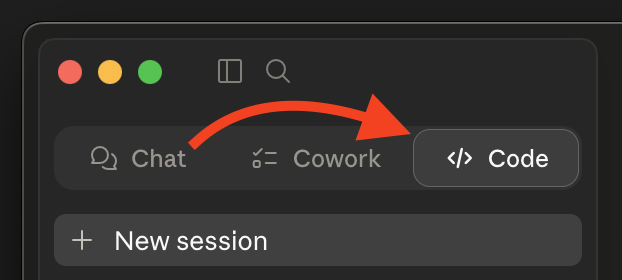

# AGS API MCP Server

A Model Context Protocol (MCP) server that gives AI assistants (VS Code Copilot, Cursor, Claude, Gemini, Antigravity) access to AccelByte Gaming Services (AGS) APIs through OpenAPI integration.

## What It Does

- **Search** AGS API operations by description, tags, method, or service
- **Describe** specific operations — parameters, schemas, auth requirements
- **Execute** API requests with your authenticated token
- **Render** query results as charts, tables, and metrics (see [Analytics & Visualization](#analytics--visualization))

AccelByte hosts the AGS API MCP Server for you — **you don't need to install or run anything locally**. Just point your AI assistant at your environment's MCP URL and sign in.

---

## Quick Install

Paste this into your AI coding assistant — it will fetch the install guide, ask you a couple of questions, and configure everything for you:

```
Install the AGS API MCP server for me. Fetch and follow the instructions at
https://raw.githubusercontent.com/AccelByte/ags-api-mcp-server/refs/heads/master/INSTALL.md
```

Works in **VS Code Copilot**, **Cursor**, **Claude Code**, **Antigravity**, and **Gemini CLI**.

> **Claude Desktop users:** The simplest path is **Settings → Connectors → Add custom connector** (Name: `ags-api`, URL: your MCP URL) — no AI installer needed. See [Claude Desktop](#claude-desktop) below for the full instructions and the fallback for accounts where workspace policy blocks custom connectors.
>
> If you do want to use the Quick Install prompt above, switch to the **Code** tab first (Chat and Cowork can't edit your config file).
>
> 

Prefer to do it yourself? See [Manual Install](#manual-install) below.

---

## Manual Install

### Step 1: Find Your MCP Server URL

The URL depends on which AGS edition you're on:

| Edition | URL format |
|---|---|
| **Shared Cloud** | `https://{studio}-{game}.prod.gamingservices.accelbyte.io/mcp/{studio}-{game}` |
| **Private Cloud** | `https://{environment-name}.accelbyte.io/mcp` (or a custom domain) |

- **Shared Cloud** customers receive `{studio}` and `{game}` namespaces at registration. Note that `{studio}-{game}` appears **twice** in the URL.
- **Private Cloud** customers may need to coordinate with AccelByte support to enable the MCP endpoint or set up a custom domain.

Not sure which edition you're on? Check with your AccelByte administrator.

### Step 2: Configure Your Client

The deployed server uses **OAuth 2.0 with PKCE and Dynamic Client Registration (DCR)**. If your client supports DCR, you can connect to the URL directly. If not — or if your client only supports stdio transport — use [`mcp-remote`](https://www.npmjs.com/package/mcp-remote) as a bridge.

> **Need `mcp-remote`?** It runs via `npx`. You need **Node.js 18+ with `npx` available** — verify with `npx --version`. Most installers (nodejs.org, Homebrew, `nvm`, official Windows installer) bundle `npx` via `npm` automatically, but minimal Linux distros sometimes ship Node without it; install `npm` from your package manager if that's the case. No global `mcp-remote` install required.

Substitute your URL from Step 1 wherever you see `<URL>` below.

#### Visual Studio Code (Copilot)

`.vscode/mcp.json` in your workspace (or user `settings.json`):

```json
{
  "servers": {
    "ags-api": {
      "type": "http",
      "url": "<URL>"
    }
  }
}
```

If you hit DCR errors, swap to: `{ "command": "npx", "args": ["-y", "mcp-remote", "<URL>"] }`.

See the [VS Code MCP documentation](https://code.visualstudio.com/docs/copilot/customization/mcp-servers).

#### Cursor

`.cursor/mcp.json` in your workspace (or user settings):

```json
{
  "mcpServers": {
    "ags-api": {
      "type": "http",
      "url": "<URL>"
    }
  }
}
```

If you hit DCR errors, swap to: `{ "command": "npx", "args": ["-y", "mcp-remote", "<URL>"] }`.

See the [Cursor MCP documentation](https://cursor.com/docs/context/mcp#using-mcpjson).

#### Claude Code

```bash
claude mcp add --transport http ags-api <URL>
```

Fallback: `claude mcp add ags-api -- npx -y mcp-remote <URL>`.

See the [Claude Code MCP documentation](https://code.claude.com/docs/en/mcp#installing-mcp-servers).

#### Antigravity

`mcp_config.json` in your project root:

```json
{
  "mcpServers": {
    "ags-api": {
      "type": "http",
      "url": "<URL>"
    }
  }
}
```

If you hit DCR errors, swap to: `{ "command": "npx", "args": ["-y", "mcp-remote", "<URL>"] }`.

See the [Antigravity MCP documentation](https://antigravity.google/docs/mcp#connecting-custom-mcp-servers).

#### Gemini CLI

```bash
gemini mcp add --transport http ags-api <URL>
```

Fallback: `gemini mcp add ags-api -- npx -y mcp-remote <URL>`.

See the [Gemini CLI MCP documentation](https://geminicli.com/docs/tools/mcp-server/#configure-the-mcp-server-in-settingsjson).

#### Claude Desktop

Claude Desktop has two install paths. Pick the first one that works for your account:

**Option A — Custom Connector (recommended for personal / Pro accounts)**

1. Open **Settings → Connectors → Add custom connector** (under the "Customize" area).
2. Fill in:
   - **Name**: `ags-api`
   - **Remote MCP server URL**: your `<URL>` from Step 1
3. Save. Claude Desktop handles OAuth (DCR + PKCE) natively — no config file edits, no `mcp-remote`.

> **Don't see "Add custom connector"?** Some Team and Enterprise plans disable custom connectors via workspace policy. If the option is missing or greyed out, use Option B.

**Option B — `mcp-remote` config file (fallback when custom connectors are blocked)**

Edit `claude_desktop_config.json`:

- **macOS**: `~/Library/Application Support/Claude/claude_desktop_config.json`
- **Windows**: `%APPDATA%\Claude\claude_desktop_config.json`

```json
{
  "mcpServers": {
    "ags-api": {
      "command": "npx",
      "args": ["-y", "mcp-remote", "<URL>"]
    }
  }
}
```

Restart Claude Desktop after saving.

### Step 3: Sign In

When your AI assistant first calls a tool, it will open a browser to AccelByte to complete OAuth. Approve the consent screen and you're connected.

---

## Using the Tools

Once connected, your assistant has access to these tools:

### `get_token_info`

Returns details about your authenticated session — user ID, namespace, roles, expiration.

> *"What's my current user information?"*

### `search-apis`

Search AGS operations by description, HTTP method, tags, or service.

> *"Find APIs for user management"* · *"Search for inventory endpoints"*

### `describe-apis`

Get the full schema for a specific operation — parameters, request/response shapes, auth requirements.

> *"What parameters does the createItem endpoint need?"*

### `run-apis`

Execute an API request. Write operations (POST/PUT/PATCH/DELETE) prompt for consent before running.

> *"Get my user profile"* · *"List all items in my inventory"*

## Analytics & Visualization

The server exposes 15 render tools for turning tabular data into charts, tables, and metrics inside MCP hosts that support app resources:

- `render_bar_chart`, `render_line_chart`, `render_area_chart`, `render_scatter_chart`, `render_histogram_chart`, `render_box_chart`, `render_heatmap_chart`
- `render_pie_chart`, `render_donut_chart`, `render_waterfall_chart`, `render_funnel_chart`, `render_gauge_chart`, `render_state_timeline_chart`
- `render_table`, `render_metric`

All render tools require a `provider`:

- `provider="facade"` reads Athena Facade results by `query_id` + `namespace`
- `provider="direct"` renders small inline datasets from `data_columns` + `data_rows`

The typical Athena Facade flow:

1. Use `run-apis` to submit a query via `POST /afs/v1/admin/namespaces/{namespace}/queries`, preferably with `wait_ms=0` if you plan to render by `query_id`
2. Poll `GET /afs/v1/admin/namespaces/{namespace}/queries/{id}` until `status="SUCCEEDED"`
3. Pass that `query_id` to a `render_*` tool with `provider="facade"`

If the submit returns `200` with inline rows on the fast path, render those rows directly with `provider="direct"`.

See [docs/ARCHITECTURE.md](docs/ARCHITECTURE.md#render-tools) for the render-tool input matrix and the Athena Facade operation list.

### Workflow Prompts

The server also provides workflow resources and prompts. Ask your assistant about available workflows or invoke the `run-workflow` prompt.

## Troubleshooting

### `mcp-remote` opens a browser every time

`mcp-remote` caches tokens under `~/.mcp-auth/`. If it's re-authenticating on every launch, that directory may be unwritable or hold stale entries.

First, check permissions on `~/.mcp-auth/` (it needs to be writable by your user). If permissions look fine, the cache may be stale — back the directory up (e.g. `mv ~/.mcp-auth ~/.mcp-auth.bak`) and retry. Restore the backup if the move doesn't help. **Note:** removing the cache will sign you out of every MCP server you've authenticated with via `mcp-remote`, not just this one.

### Native config fails with an OAuth or DCR error

Your client may not yet support Dynamic Client Registration. Switch to the `mcp-remote` fallback config shown above.

### Sign-in succeeds but tool calls fail with 403

Your AccelByte user may not have permission for the operation you're calling. Check with your AGS administrator.

## Documentation

- [Installation Guide](INSTALL.md) — followed by the Quick Install prompt; readable on its own
- [Architecture](docs/ARCHITECTURE.md) — design, security mechanisms, render tools, AFS operations
- [Environment Variables](docs/ENVIRONMENT_VARIABLES.md) — for self-hosters
- [Self-Hosting & Development](docs/DEVELOPMENT.md) — build, run, test, deploy with Docker

> Looking for V1? See [docs/v1/README.md](docs/v1/README.md) (legacy; stdio + server-managed OAuth).

## Contributions

This repository is published as-is. We don't accept external pull requests at this time. For bug reports and questions, please open an issue.
